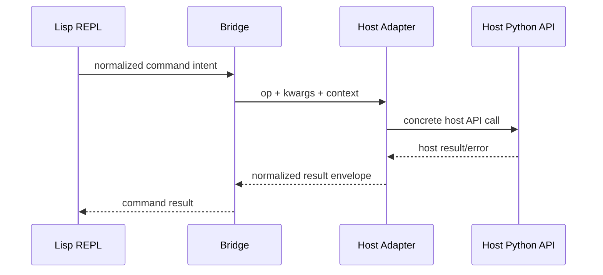

# Adapter Model

## Goal

Define a host adapter contract that translates normalized bridge intents into concrete host API calls.

## Host Targets

- Blender (`bpy`) - MVP target
- Krita (Python API) - planned next target

## Adapter Contract

Input:

- normalized operation ID
- typed keyword parameters
- optional execution context (selection/session/runtime hints)

Output:

- deterministic host call plan
- execution result envelope (`status`, `value`, `errors`, `warnings`)

Error contract:

- normalized error type
- human-readable message
- recoverable flag
- suggested next action

## Boundary Rules

- host side effects happen only inside adapter execution boundaries
- adapter should not own REPL parsing or plugin discovery
- adapter should not read/write framework global state directly
- adapter should be invokable from tests with mocked host APIs

## Translation Example

- Lisp form: `(mesh:cube :size 2)`
- bridge intent: `op=mesh.cube`, `kwargs={size: 2}`
- Blender adapter call: `bpy.ops.mesh.primitive_cube_add(size=2)`

## Mermaid: Adapter Translation Path

## MVP Boundary

- one Blender adapter path is sufficient for MVP acceptance
- adapter interface must be host-agnostic so new adapters can be added without changing REPL core

## Linked Roadmap Items

- `ROADMAP.md` -> `Target execution model`
- `ROADMAP.md` -> `Foldering decision: REPL outside src`
- `ROADMAP.md` -> `Functional programming guideline (implementation quality gate)`
- `ROADMAP.md` -> `MVP (smallest viable implementation)`
