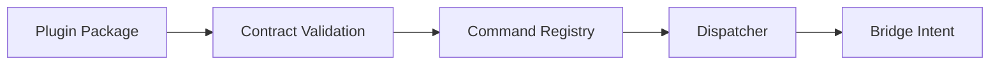

# Plugin Architecture

## Goal

Define how commands are extended without coupling plugins to runtime internals.

## Boundary

- plugin loading and discovery belongs to `tools/repl/` side
- runtime-only `src/` should not depend on plugin loader orchestration
- plugin APIs must remain host-agnostic at registration time

## Command Contract

Each plugin command contract should define:

- command identifier
- argument schema (required, optional, typed keywords)
- execution handler target (bridge intent or host-agnostic operation)
- result envelope shape (`status`, `value`, `errors`, optional metadata)

## Registry Responsibilities

- validate command contract at registration time
- reject conflicting command IDs unless explicitly overridden by policy
- expose command metadata for REPL help/completion
- provide pure command lookup and dispatch planning functions

## Plugin Lifecycle

- discover -> validate -> register -> dispatchable
- unregister/remove should restore baseline registry state
- failed plugin registration should not corrupt active registry state

## Safety Rules

- plugin code should not mutate global runtime state implicitly
- side effects must occur at explicit bridge/adapter boundaries
- plugin contracts should be testable without host application process

## Mermaid: Plugin Injection Model

## Initial MVP Policy

- support one plugin injection path
- support one builtin plugin example
- include conflict policy (`reject` default)
- include registry introspection for REPL help/completion

## Linked Roadmap Items

- `ROADMAP.md` -> `Architecture document package (complete spec)`
- `ROADMAP.md` -> `Core design principles (enforced)`
- `ROADMAP.md` -> `Functional programming guideline (implementation quality gate)`
- `ROADMAP.md` -> `MVP (smallest viable implementation)`
