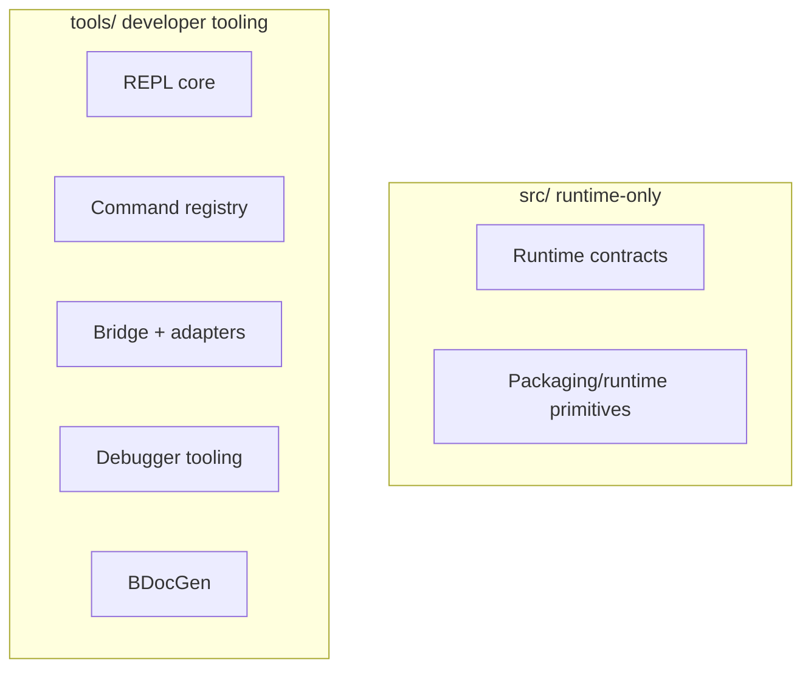

# REPL Architecture

## Goal

Build a Common Lisp-first interactive development environment that controls Python host APIs (starting with Blender) while keeping shipped runtime code minimal.

## Design Principles

- simplicity over complexity
- each component does one thing well
- functional style by default (small, composable functions)
- minimal core, extensible tooling
- strict runtime/tooling separation

## Target Execution Model

Canonical flow:

`Common Lisp REPL -> command registry -> embedded Python bridge -> host adapter -> host Python API -> host application`

Primary control path is in-process and does not require RPC/network transport.

## Component Boundaries

- REPL core (`tools/repl/`)
  - read/eval/dispatch loop
  - session state and command routing
  - REPL settings and profile handling

- command registry (`tools/repl/`)
  - command contracts and argument schema
  - plugin registration and discovery hooks

- bridge layer (`tools/interop/` or `tools/repl/bridge/`)
  - Lisp form to Python call intent translation
  - host-agnostic command result envelope

- host adapters (`tools/adapters/<host>_adapter/`)
  - map normalized bridge intents to host API calls
  - isolate host-specific side effects

- runtime core (`src/`)
  - production-safe runtime logic only
  - no interactive shell/repl/debugger implementation ownership

## Runtime vs Tooling Boundary

- allowed in `src/`: runtime contracts, packaging/test runtime logic, minimal interop primitives required by shipped runtime
- not allowed in `src/`: REPL UI loop, plugin loading orchestration, interactive debugger UX, docs-tool orchestration
- allowed in `tools/`: REPL loop, adapters, developer debugger tooling, docs generation tooling

## Repository Layout Targets

- `addons/` - addon source workspaces
- `src/` - runtime-only implementation
- `tools/repl/` - Common Lisp REPL implementation
- `tools/adapters/` - host adapters (`blender_adapter/`, `krita_adapter/`)
- `tools/debugger/` - debugger tooling
- `tools/bdocgen/` - docs tooling
- `releases/` - compiled output artifacts

Configuration target:

- `tools/repl/config.lisp`

## Mermaid: Control Flow

## Mermaid: Ownership Boundary

## MVP Scope

MVP is complete when all are true:

- minimal REPL shell exists in `tools/repl/` (read/eval/dispatch)
- command registry supports one plugin injection path
- embedded Python bridge supports Blender adapter path
- at least one end-to-end command translation is demonstrated (for example `(mesh:cube :size 2)`)
- runtime package can be produced without requiring `tools/` at runtime

## Incremental Milestones

1. define command registry contract and one builtin command path
2. add bridge prototype and one Blender adapter operation
3. add REPL settings model and runtime override precedence
4. move/retire Python REPL path and keep compatibility shim window
5. harden boundaries with tests around pure logic first, integration second

## Migration Notes

- Python REPL command path is transitional and planned for removal.
- New architecture work should target Common Lisp REPL implementation first.
- Transitional docs should call out whether behavior is target-state or compatibility-state.

## Linked Roadmap Items

- `ROADMAP.md` -> `Architecture document package (complete spec)`
- `ROADMAP.md` -> `Core design principles (enforced)`
- `ROADMAP.md` -> `Target execution model`
- `ROADMAP.md` -> `Foldering decision: REPL outside src`
- `ROADMAP.md` -> `src refactor toward minimal runtime boundaries`
- `ROADMAP.md` -> `MVP (smallest viable implementation)`
